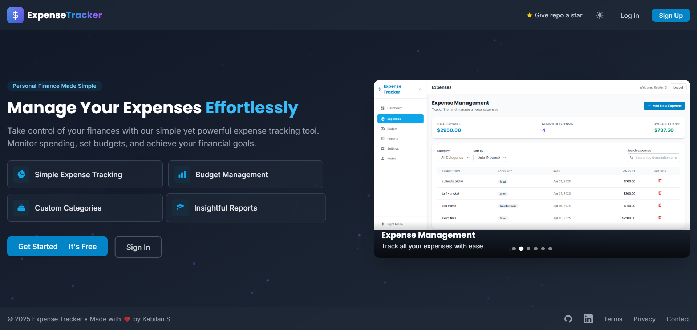
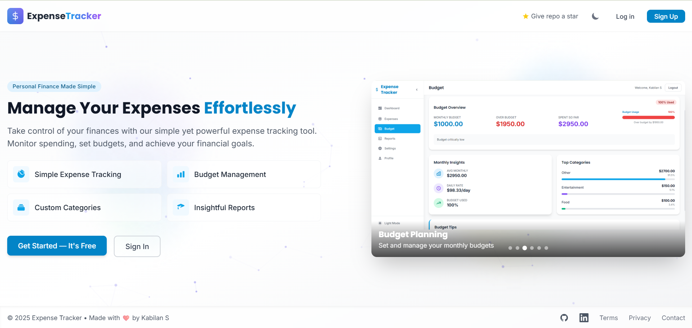
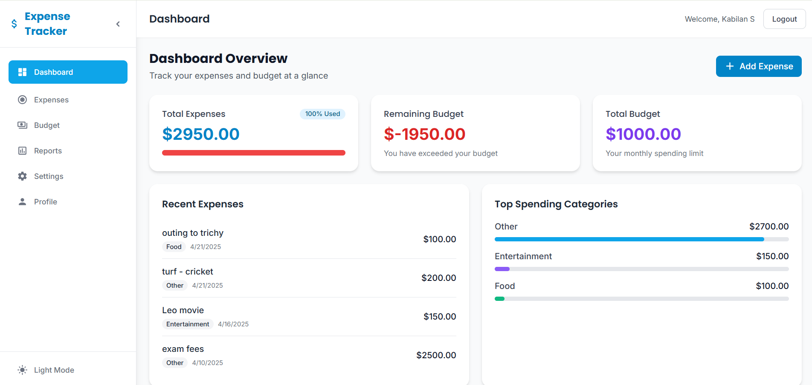
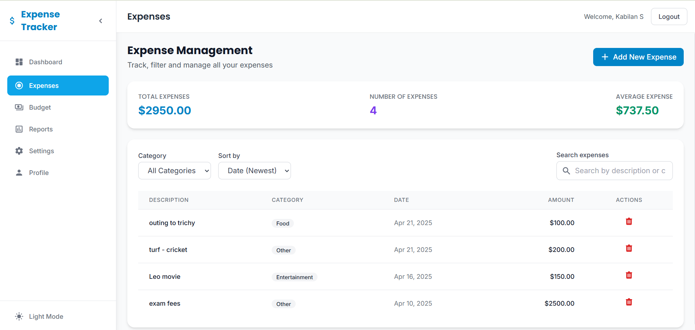
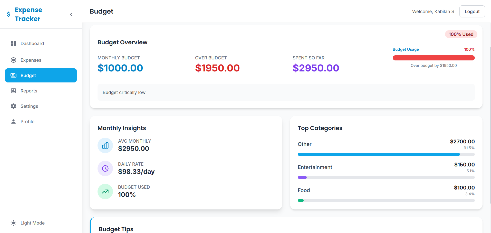
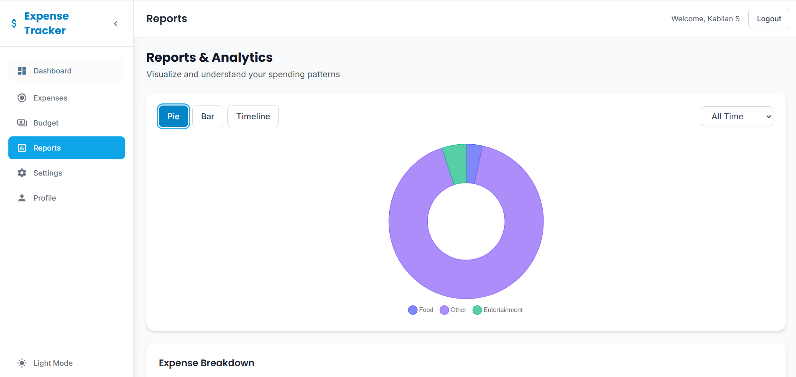
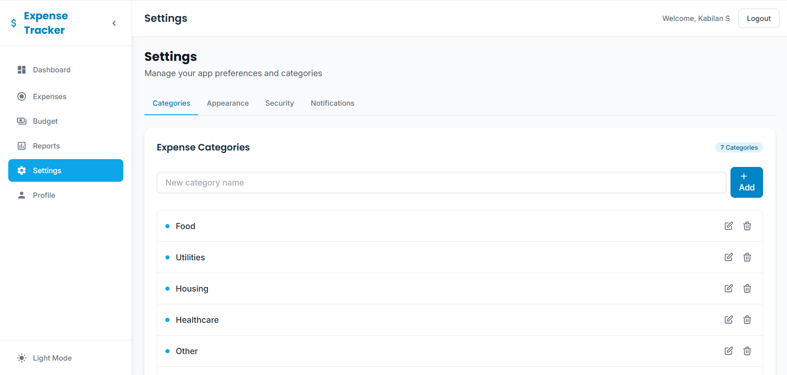
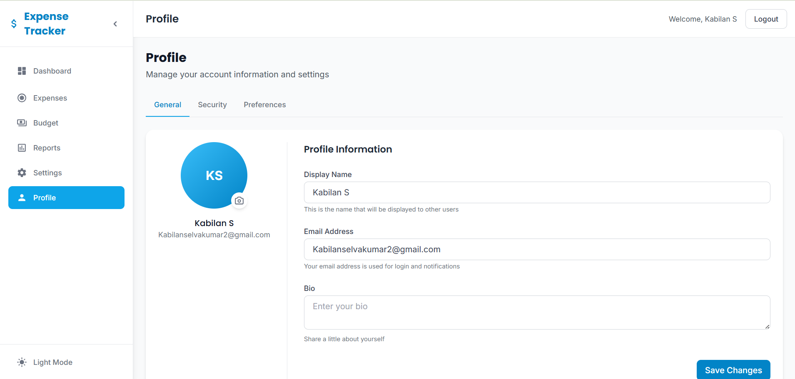

# Expense Tracker

A full-featured expense tracking application built with React and Node.js that helps users manage their personal finances.

### Landing Page




### Dashboard Page



## Features

### User Authentication

- Email & Password authentication
- Google OAuth integration
- Password reset functionality
- User profile management

### Dashboard

- Financial overview with total expenses, budget, and remaining budget
- Visual budget usage progress bar
- Recent expenses list
- Top spending categories visualization

### Expense Management

- Add, delete, and categorize expenses
- Filter expenses by category
- Sort expenses by date, amount, category, or description
- Search for specific expenses

### Budget Planning

- Set and update monthly budget
- Visual budget vs. expense comparison
- Category-specific budget allocation
- Budget utilization tracking

### Financial Reports

- Monthly expense trends
- Category-based expense breakdown
- Downloadable reports
- Visual data representations

### Category Management

- Create custom expense categories
- Update or delete existing categories
- Track spending by category

### Profile & Settings

- User profile customization
- Password management
- Dark/Light mode toggle
- Account preferences

### Responsive Design

- Mobile-friendly interface
- Sidebar navigation that adapts to screen size
- Optimized viewing experience on all devices

## Screenshots

### Expense Management



### Budget Planning



### Financial Reports



### Category Management



### Profile Settings



## Technology Stack

### Frontend

- React.js
- React Router for navigation
- Axios for API requests
- Framer Motion for animations
- Tailwind CSS for styling
- Google OAuth integration

### Backend

- Node.js & Express
- MongoDB for database
- JWT for authentication
- Password encryption
- RESTful API design

## Getting Started

### Prerequisites

- Node.js (v14 or later)
- npm or yarn
- MongoDB database

### Installation

1. Clone the repository

```bash
git clone https://github.com/S-KABILAN/Expense-Tracker.git
cd Expense-Tracker
```

2. Install dependencies

```bash
# Install frontend dependencies
cd frontend
npm install

# Install backend dependencies
cd ../backend
npm install
```

3. Environment setup
   Create `.env` files in both frontend and backend directories:

Frontend `.env`:

```
VITE_API_BASE_URL=http://localhost:5000/api
```

Backend `.env`:

```
PORT=5000
MONGODB_URI=your_mongodb_connection_string
JWT_SECRET=your_jwt_secret
EMAIL_USER=your_email_for_password_reset
EMAIL_PASS=your_email_password
GOOGLE_CLIENT_ID=your_google_client_id
```

4. Start the application

```bash
# Start backend server
cd backend
npm start

# In a new terminal, start frontend
cd frontend
npm run dev
```

5. Access the application
   Open your browser and navigate to: `http://localhost:5173`

## Contributing

Contributions are welcome! Please feel free to submit a Pull Request.

## License

This project is licensed under the MIT License - see the LICENSE file for details.

## Acknowledgements

- Icons provided by Google Material Icons
- Theme inspiration from Tailwind UI
- Special thanks to all contributors

---

Created by [S-KABILAN](https://github.com/S-KABILAN)
